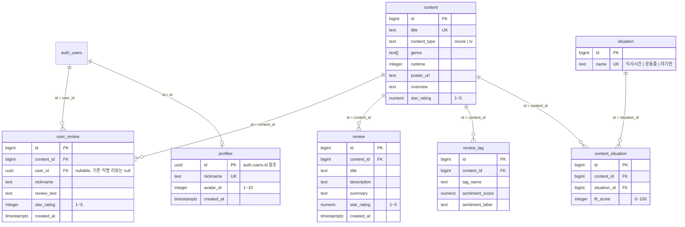

# FlixFit

넷플릭스 콘텐츠를 상황(식사시간 / 운동중 / 자기전)에 맞게 추천하고, 실관람평을 모아 보여주는 웹 서비스입니다.

- 배포: https://jwheewhee.dx6project.site/
- 레포: https://github.com/jwheewhee/ott-situation-picker

---

## 목차

1. [프로젝트 소개 (문제 정의)](#1-프로젝트-소개-문제-정의)
2. [MVP 핵심 기능](#2-mvp-핵심-기능)
3. [사용자 흐름](#3-사용자-흐름)
4. [주요 기능](#4-주요-기능)
5. [기술 스택](#5-기술-스택)
6. [아키텍처 / 데이터 파이프라인](#6-아키텍처--데이터-파이프라인)
7. [ERD](#7-erd)
8. [API 명세](#8-api-명세)
9. [AI 코딩 에이전트 활용 방식](#9-ai-코딩-에이전트-활용-방식)
10. [트러블슈팅 기록](#10-트러블슈팅-기록)
11. [회고](#11-회고)
12. [향후 개선 방향](#12-향후-개선-방향)

---

## 1. 프로젝트 소개 (문제 정의)

넷플릭스는 앱 안에서 실관람평(리뷰)을 확인할 수 없습니다. 왓챠나 CGV 앱과 비교되는 지점인데, 그래서 콘텐츠를 고를 때마다 포털이나 블로그에서 후기를 따로 검색해야 하는 번거로움이 있습니다. 또한 지금 내가 처한 상황(밥 먹으면서 볼지, 운동하면서 틀어놓을지, 자기 전에 편하게 볼지)에 따라 어울리는 콘텐츠가 다른데, 이런 상황을 고려한 큐레이션은 제공하지 않습니다.

FlixFit은 이 두 가지 문제 — **리뷰 부재**와 **상황 무시 추천** — 를 해결하기 위해 만든 서비스입니다. 넷플릭스 인기 콘텐츠에 대해 블로그 리뷰를 자동으로 수집·분석하고, 이를 바탕으로 상황별 적합도(fit_score)를 계산해 추천합니다.

기획은 개발자 본인의 CGV 근무 경험(2024.09 ~ 2026.01)에서 착안했습니다.

## 2. MVP 핵심 기능

1. **상황별 콘텐츠 추천** — 식사시간 / 운동중 / 자기전 세 가지 상황에 대해 fit_score(0~100)를 계산하고, 상황별 리스트로 제공
2. **리뷰 감성분석 요약** — 블로그 리뷰를 감성분석해 콘텐츠 평점(별점)으로 환산
3. **리뷰 키워드 태그 시각화** — TF-IDF 기반으로 리뷰에서 키워드를 뽑아 감성과 함께 태그로 표시

## 3. 사용자 흐름

```
최초 접속
  └─ 스플래시 인트로 (팝콘 마스코트 애니메이션, 1회만 재생)
       └─ 로그인 세션 없음 → 로그인 페이지로 리다이렉트
            ├─ 회원가입: 이메일 + 비밀번호 + 닉네임 + 아바타(영화 테마 10종) 선택
            │    └─ 계정 생성과 동시에 프로필(profiles) 생성 → 자동 로그인
            └─ 로그인: 이메일 + 비밀번호
                 └─ 메인 화면 (상황 선택)
                      └─ 상황별 추천 리스트 (식사시간 / 운동중 / 자기전)
                           └─ 콘텐츠 상세 페이지
                                ├─ 포스터 / 개요 / 상황별 적합도 바 / 리뷰 키워드 태그
                                ├─ 블로그 후기 요약 (4개씩 더보기)
                                └─ 시청자 리뷰 (작성 + 열람, 4개씩 더보기)
                      └─ 헤더 프로필 메뉴
                           ├─ 내 리뷰 보기 (마이페이지)
                           ├─ 닉네임 수정
                           └─ 로그아웃
```

## 4. 주요 기능

실제 구현 범위는 MVP 3가지에서 상당히 확장되었습니다.

### 콘텐츠 데이터 수집

- Netflix 공식 Top10 데이터(`netflix.com/tudum/top10/data/all-weeks-global.xlsx` 공식 다운로드)와 TMDB `discover` API(인기도순, `vote_count.gte=100` 필터)를 병합해 라인업을 구성합니다. Top10에 있는 제목을 우선하고, discover 결과에서 중복 제목은 제외합니다.
- 콘텐츠 규모는 94~100개 수준이며, 동기화(`/api/sync`) 시 이번 결과에 없는 오래된 콘텐츠는 자동으로 정리됩니다. 단, 시청자가 실제로 리뷰를 남긴 콘텐츠는 순위 밖으로 밀려도 삭제하지 않습니다.

### 블로그 리뷰 파이프라인

- 네이버 검색 API로 리뷰 후보를 수집한 뒤, 제목/설명에 무관한 키워드(방탈출·카페 등)나 홍보성 링크가 섞인 글을 1차로 걸러냅니다.
- 살아남은 후보는 블로그 원문을 크롤링해 OpenAI(`gpt-4o-mini`)로 (1) 실제 감상평인지 관련성 판단, (2) 2문장 이내 요약, (3) 1~5점 별점 산정을 한 번에 처리합니다.
- 콘텐츠당 최대 6개 요청을 동시에 보내는 병렬 처리(ThreadPoolExecutor)로 처리하고, 콘텐츠당 목표 리뷰 개수(12개)에 도달하면 나머지 요청은 취소합니다.

### 시청자 리뷰

- 로그인한 사용자가 콘텐츠에 직접 별점 + 리뷰를 작성할 수 있습니다. 닉네임은 입력받지 않고 프로필 닉네임을 자동으로 사용합니다.
- 4개씩 페이지네이션(더보기)으로 표시하며, 작성 직후 토스트 메시지로 등록 완료를 알립니다.

### 로그인 / 프로필

- Supabase Auth(이메일 + 비밀번호) 기반이며, 로그인하지 않으면 메인 화면 이하 전 경로 접근이 막힙니다.
- 회원가입 시 영화 테마 아바타 10종(팝콘, 필름 릴, 클래퍼보드, 3D 안경, 영화 티켓, 카메라, 콜라+팝콘 콤보, VHS 테이프, 트로피, 무대 커튼) 중 하나를 선택합니다.
- 헤더 프로필 드롭다운에서 닉네임을 즉시 수정할 수 있고, 마이페이지에서 내가 남긴 리뷰를 모아 볼 수 있습니다.

### 브랜딩 / UX 디테일

- 넷플릭스 톤의 다크 테마(`#141414` 배경, `#E24B4A` 포인트 컬러), FlixFit 로고
- 커스텀 마스코트 3종: 팝콘+리모컨, TV, 소파강아지 (직접 그린 SVG)
- 팝콘 마스코트가 리모컨을 누르면 화면이 전환되는 스플래시 인트로 애니메이션 (최초 1회, `sessionStorage`로 재생 제어)
- 파비콘, 토스트 메시지, fit_score 설명 툴팁, 404 페이지, 카드/버튼 호버 트랜지션, 모바일 반응형 레이아웃

## 5. 기술 스택

| 구분 | 스택 |
|---|---|
| Backend | Python, FastAPI |
| Frontend | React (Vite), React Router |
| Database / Auth | Supabase (PostgreSQL + Auth, RLS) |
| 외부 API | TMDB API, 네이버 오픈API(블로그 검색), OpenAI API(`gpt-4o-mini`), Netflix 공식 Top10 데이터 |
| 텍스트 분석 | KNU 한국어 감성사전, TF-IDF(scikit-learn), KoNLPy(Okt) |
| 배포 | 백엔드: Docker(`backend/Dockerfile`, Python 3.12-slim + OpenJDK headless) 컨테이너 · 프론트엔드: Vite 정적 빌드 (호스팅/CI 파이프라인 세부 구성은 레포에 별도 설정 파일로 남아있지 않아 추후 기입) |

## 6. 아키텍처 / 데이터 파이프라인

```mermaid
flowchart LR
    A[Netflix Top10 + TMDB discover<br/>콘텐츠 수집] --> B[네이버 블로그<br/>리뷰 검색]
    B --> C[OpenAI 관련성 판단<br/>+ 요약 + 별점<br/>(병렬 처리)]
    C --> D[fit_score 계산<br/>러닝타임 · 장르 · 감성점수]
    D --> E[(Supabase<br/>PostgreSQL)]
    E --> F[FastAPI 조회 API]
    F --> G[React 화면]
    G -.로그인/리뷰 작성.-> E
```

파이프라인 실행은 `POST /api/sync` 한 번으로 위 A~D 단계가 순서대로 실행되고 결과가 Supabase에 저장됩니다. 프론트엔드는 이렇게 저장된 데이터를 조회 전용 API로 읽어옵니다.

## 7. ERD



- `content_situation`은 `(content_id, situation_id)` 유니크 제약을 가지며 fit_score 재계산 시 upsert됩니다.
- `profiles`는 `auth.users`를 직접 참조하는 Supabase Auth 연동 테이블이며, RLS가 켜져 있습니다: 조회는 전체 공개, insert/update는 `auth.uid() = id`인 본인만 가능합니다.
- `user_review.user_id`는 nullable입니다 — 로그인 필수 정책 도입 이전에 작성된 익명 리뷰(`user_id = null`)와 이후 로그인 리뷰가 공존합니다. 유저 탈퇴 시에도 리뷰 자체는 남고 `user_id`만 null로 바뀝니다(`on delete set null`).

## 8. API 명세

프론트엔드가 실제로 호출하는 엔드포인트와, 데이터 파이프라인 실행/디버깅용 내부 엔드포인트를 구분했습니다.

### 프론트엔드 연동 API

| Method | Path | 인증 | 설명 |
|---|---|---|---|
| GET | `/api/situations/{situation_name}/contents` | - | 상황별 추천 리스트. fit_score 60점 이상 + 리뷰가 1개 이상 있는 콘텐츠만 반환 |
| GET | `/api/contents/{content_id}` | - | 콘텐츠 상세 (fit_scores, 리뷰 키워드, 블로그 리뷰 요약, 시청자 리뷰 + 작성자 아바타 포함) |
| POST | `/api/contents/{content_id}/reviews` | ✅ | 시청자 리뷰 작성. `review_text`(5자 이상), `star_rating`(1~5)만 body로 받고 닉네임은 프로필에서 자동 조회 |
| GET | `/api/my/reviews` | ✅ | 로그인한 사용자가 작성한 리뷰 전체를 콘텐츠 정보(title, poster_url)와 함께 최신순 반환 |
| PATCH | `/api/profile` | ✅ | 닉네임 변경. 중복 닉네임이면 409 반환 |

인증은 `Authorization: Bearer {Supabase 세션 access_token}` 헤더로 전달하며, 서버는 `supabase.auth.get_user()`로 토큰을 검증합니다.

### 데이터 파이프라인 / 내부 API

| Method | Path | 설명 |
|---|---|---|
| GET | `/health` | 헬스체크 |
| GET | `/api/contents` | TMDB 인기 영화 원본 조회 (디버깅용) |
| GET | `/api/reviews?movie_title=` | 특정 제목의 네이버 블로그 검색 원본 조회 (디버깅용) |
| GET | `/api/contents-with-reviews` | 콘텐츠 + 리뷰 후보 병합 (파이프라인 중간 단계) |
| GET | `/api/contents-analyzed` | 위 결과에 감성분석 + 키워드 추출 적용 |
| GET | `/api/contents-scored` | 위 결과에 fit_score 계산까지 적용 |
| POST | `/api/sync` | 전체 파이프라인 실행 후 Supabase에 저장 |

## 9. AI 코딩 에이전트 활용 방식

전 과정에서 Claude Code를 사용했습니다. 데이터 파이프라인 설계, 백엔드/프론트엔드 구현, DB 마이그레이션 작성, 실제 브라우저 기반 E2E 테스트까지 전 영역에 걸쳐 있습니다.

작업 방식은 요구사항을 한 번에 몰아서 던지지 않고 작은 단위로 나눠 순서대로 진행하는 쪽을 택했습니다. 예를 들어 로그인 기능은 "DB 마이그레이션 → 백엔드 인증 의존성/엔드포인트 → 프론트엔드 페이지/라우팅" 순서로 별도 요청을 나눴고, UI 폴리시 작업(파비콘·토스트·404 페이지 등)은 "항목별로 구현 후 곧바로 실제 브라우저에서 확인하고 결과를 보고받은 뒤 다음 항목으로 진행"하는 방식으로 진행했습니다. 스플래시 애니메이션처럼 타이밍이 중요한 기능은 Playwright로 여러 시점의 스크린샷/`getComputedStyle` 값을 직접 캡처해 의도한 구간에서 의도한 상태(투명도, transform 값 등)가 나오는지 수치로 검증했습니다.

이 과정에서 에이전트가 스스로 짚어낸 문제도 있었습니다. 예를 들어 스플래시 화면의 페이드아웃 애니메이션이 배경과 콘텐츠를 동시에 투명하게 만들면서 다음 화면과 겹쳐 보이는 "이중노출" 현상을 검증 스크린샷에서 직접 발견하고, 애니메이션 구간을 겹치지 않게 재설계해 수정한 사례가 있습니다.

## 10. 트러블슈팅 기록

### 1) 네이버 검색 리뷰에 무관한 콘텐츠가 섞임

- **현상**: 영화 제목으로 네이버 블로그를 검색하면 동명의 방탈출 카페 후기, 체험 후기 등 작품과 무관한 글이 섞여 들어왔습니다.
- **원인**: 네이버 검색 API는 제목 매칭만 하기 때문에, 영화 제목과 같은 이름의 장소·상품이 있으면 구분하지 못했습니다.
- **해결**: 처음에는 무관한 키워드(방탈출, 카페, 체험 등)를 걸러내는 규칙 기반 필터로 시도했지만 한계가 뚜렷했습니다. 최종적으로 블로그 원문을 LLM(OpenAI)에 넘겨 "이 글이 실제로 이 작품에 대한 감상평인지" 판단하게 하는 방식으로 전환했습니다. 다만 LLM 호출 전에 명백히 무관한 키워드/홍보 링크가 섞인 글은 규칙 기반으로 먼저 걸러 API 비용을 아끼는 1차 필터는 지금도 남아 있습니다.

### 2) 블로그 스니펫 요약 품질이 낮음

- **현상**: 네이버 검색 API가 주는 설명(description)은 문장이 잘린 스니펫이라 요약이랄 게 없었고, 그대로 노출하기엔 품질이 떨어졌습니다.
- **원인**: 검색 API 응답 자체가 완결된 문장을 보장하지 않는 짧은 발췌문이었습니다.
- **해결**: 처음엔 무료 로컬 요약 모델(KoBART)을 시도했지만, 뉴스 기사에 특화된 모델이라 캐주얼한 블로그 문체에는 요약 품질이 잘 맞지 않았습니다. 결국 블로그 원문 전체를 크롤링한 뒤 LLM으로 요약하는 방식으로 전환했습니다.

### 3) LLM 리뷰 처리가 순차 실행이라 너무 오래 걸림

- **현상**: 콘텐츠 94개 기준으로 리뷰를 LLM에 하나씩 순차로 넘기면 3시간 이상 걸릴 것으로 예상됐습니다.
- **원인**: 콘텐츠당 여러 개의 블로그 후보를 하나씩 순차 호출(관련성 판단 + 요약 + 별점을 한 번의 LLM 호출로 처리)하고 있었습니다.
- **해결**: `ThreadPoolExecutor`로 콘텐츠당 최대 6개 요청을 동시에 처리하도록 병렬화하고, 콘텐츠당 목표 리뷰 개수(12개)에 도달하면 남은 후보 처리를 즉시 취소하는 조기 종료 로직을 추가해 34분까지 단축했습니다.

### 4) TMDB discover만으로는 무명작 위주로 수집됨

- **현상**: TMDB `discover` API로만 콘텐츠를 모으면 인지도가 낮은 작품 위주로 채워져 추천 라인업의 신뢰도가 떨어졌습니다.
- **원인**: `discover` API는 필터 조건에 맞는 콘텐츠를 폭넓게 반환할 뿐, 실제 인기도를 보장하지 않았습니다.
- **해결**: `vote_count.gte=100` 필터로 최소한의 검증된 작품만 남기고, 여기에 Netflix 공식 Top10 데이터를 병합해(Top10 우선) 라인업 신뢰도를 개선했습니다.

### 5) sync를 반복 실행하면 review/review_tag가 중복 누적됨

- **현상**: `/api/sync`를 여러 번 실행하면 같은 리뷰와 키워드 태그가 계속 쌓여 중복이 늘어났습니다.
- **원인**: `review`, `review_tag` 테이블에 기존 데이터를 정리하지 않고 매번 insert만 하고 있었습니다.
- **해결**: 저장 전에 해당 콘텐츠의 기존 `review`, `review_tag` 행을 먼저 삭제한 뒤 새로 insert하는 delete-then-insert 방식으로 전환했습니다.

### 6) 콘텐츠 목록 갱신 시 시청자 리뷰가 유실될 위험

- **현상**: sync를 실행할 때마다 이번 결과에 없는 콘텐츠를 정리하는데, 그 콘텐츠에 시청자가 남긴 리뷰가 있으면 콘텐츠 삭제와 함께(cascade) 리뷰까지 사라질 위험이 있었습니다.
- **원인**: 콘텐츠 정리 로직이 "이번 sync 결과에 있는지" 여부만 보고 삭제 대상을 판단했습니다.
- **해결**: 삭제 대상 콘텐츠 중 `user_review`가 하나라도 달려 있는 콘텐츠는 순위 밖으로 밀려도 삭제하지 않도록 보호 로직을 추가했습니다. 스크래핑으로 다시 채울 수 있는 `review`/`review_tag`와 달리, 실제 사용자가 남긴 데이터는 복구할 수 없다는 판단이었습니다.

## 11. 회고

### 잘된 점

- 기능을 작은 단위로 나눠 진행하고, 매 단계마다 실제 브라우저(Playwright)나 API 호출로 검증한 뒤 다음 단계로 넘어가는 방식을 끝까지 유지했습니다. 덕분에 문제를 최대한 그 자리에서 발견하고 넘어갈 수 있었습니다.
- 리뷰 데이터 품질 문제(관련성, 요약 품질)를 발견할 때마다 안일하게 넘기지 않고 접근 방식 자체를 바꿔가며(키워드 매칭 → LLM 판단, 스니펫 → 원문 크롤링 + LLM 요약) 개선했습니다.
- 처리 시간이 병목이 되는 지점(LLM 순차 호출)을 병렬화 + 조기 종료로 실질적으로 줄였습니다.

### 아쉬운 점

- 마스코트/스플래시 애니메이션처럼 감각적인 디테일은 원하는 느낌이 나올 때까지 여러 차례 세부 조정(타이밍, 아바타 디자인, 글로우 효과 등)을 거쳐야 했고, 그만큼 반복 작업 비중이 컸습니다.
- review/review_tag 중복 누적이나 프랜차이즈 제목 오매칭처럼, 실제로 반복 실행해보기 전에는 드러나지 않는 버그가 뒤늦게 발견된 경우가 있었습니다.
- Supabase의 "Confirm email" 같은 배포 환경 설정을 로그인 기능 구현 전에 충분히 점검하지 못해, 회원가입 플로우가 해당 설정에 따라 동작이 달라질 수 있다는 걸 뒤늦게 인지했습니다.

### 배운 점

- 리뷰 관련성 판단처럼 정성적인 문제는 규칙 기반보다 LLM 판단이 훨씬 안정적이지만, 명백한 케이스는 규칙 기반으로 먼저 걸러 LLM 호출 비용을 아끼는 하이브리드 구조가 실용적이었습니다.
- 무료·로컬 모델이 항상 정답은 아니며, 학습 도메인(뉴스 기사 vs 캐주얼한 블로그체)이 실제 데이터와 얼마나 맞는지가 모델 선택보다 더 중요했습니다.
- 데이터 동기화 로직은 "최신 결과로 덮어쓰기"가 아니라 "사용자가 직접 만든 데이터는 보호"하는 방향으로 설계해야 한다는 걸, 삭제 위험을 실제로 마주치고 나서야 명확히 정리할 수 있었습니다.

## 12. 향후 개선 방향

- **개인 맞춤 추천**: 사용자별 장르 선호 등을 반영한 추천. 이번 범위에서는 검토했으나 제외했습니다.
- **리뷰 원문 크롤링 대상 확대**: 현재는 네이버 블로그 중심이며, 다른 플랫폼(브런치, 커뮤니티 등)으로 수집 범위를 넓힐 여지가 있습니다.
- **KoNLPy(Java 의존성) 배포 환경 최적화**: 현재 Docker 이미지에 OpenJDK를 함께 설치하고 있어 이미지 크기와 빌드 시간에 영향을 줍니다. 더 가벼운 형태소 분석 방식으로의 전환을 검토할 수 있습니다.
